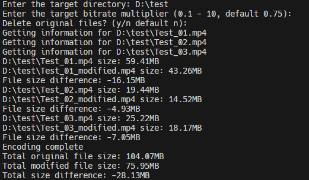

# Auto Encoder Py

This project is a Python script that automates the process of encoding video files in a specified directory using the `ffmpeg` library. The script traverses through the target directory, retrieves video file information, encodes the videos to a specified bitrate, and compares the original and encoded file sizes.

## Requirements

- Python 3.x
- `ffmpeg` library
- `ffmpeg-python` library

## Installation

1. Install Python 3.x from the official [Python website](https://www.python.org/).
2. Install `ffmpeg` by following the instructions on the official [FFmpeg website](https://ffmpeg.org/download.html).
3. Install dependencies with requirements.txt:
  ```sh
  pip install -r requirements.txt
  ```

## Usage

1. Clone the repository or download the script.
2. Open a terminal or command prompt and navigate to the directory containing the script.
3. Run the script using Python:
  ```sh
  python main.py
  ```
4. Enter the target directory when prompted.
5. Enter the target bitrate multiplier (0.1 - 10, default 0.75) when prompted.

The script will encode the video files in the target directory to H.265 format with the specified bitrate multiplier. The original files will be deleted if you choose to do so.



## Functions

- `get_file_list(target_dir)`: Retrieves a list of video files in the target directory and its subdirectories, excluding files with `_modified` in their names.
- `get_file_info(file)`: Retrieves the file size and video bitrate of the specified file.
- `encode_video(file, bitrate)`: Encodes the video file to H.265 format with the specified bitrate using hardware acceleration.
- `compare_files(file1, file2)`: Compares the sizes of the original and encoded files and deletes the original file.
- `main()`: Main function that orchestrates the encoding process.

## License

This project is licensed under the MIT License. See the [LICENSE](LICENSE) file for details.

## Acknowledgements

- [FFmpeg](https://ffmpeg.org/)
- [ffmpeg-python](https://github.com/kkroening/ffmpeg-python)


